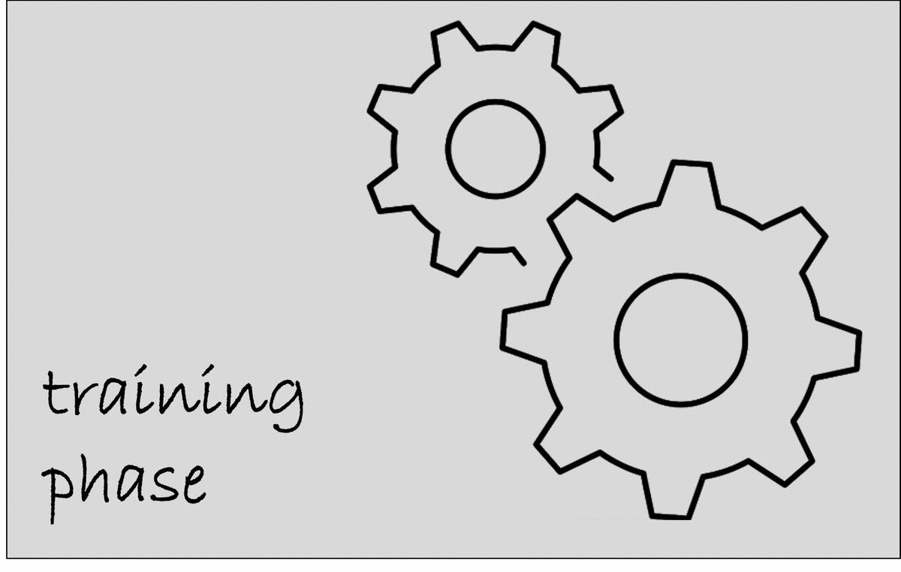

 

[-green.svg)](https://www.gnu.org/licenses/old-licenses/gpl-2.0.html)

A tool for automatically inferring rules aimed at identifying the occurrences of natural language patterns in software informal documentation.
NEON provides a user-friendly GUI. Alternatively, it can also be used programmatically by exploiting its API.  

## Using NEON's Graphic User Interface (GUI) 

Please clone the NEON repository in a local folder of your choice.

The tool uses the following open source Java libraries: 
- version 3.4.1 of the Stanford CoreNLP library 
- version 0.23 of the Efficient Java Matrix Library 
- version 1.0.0 of the java-string-similarity library 
- version 4.4.2 of the simplenlg library 
- version 1.0.1 of the ws4j library 

You can find the needed jar files for running the tool in the ```/lib``` folder of the cloned repository.

Please add these jars and ```NEON.jar``` to the java classpath and run the ```org.neon.main.Main``` class.

Here we provide a running example from command Line:

Running example for Windows systems:
```
javaw -classpath "[MYPATH]/NEON_tool/lib/*;[MYPATH]/NEON_tool/NEON.jar" org.neon.main.Main
```
  
Running example for Unix/Linux/MacOS systems:
```
javaw -classpath "[MYPATH]/NEON_tool/lib/*:[MYPATH]/NEON_tool/NEON.jar" org.neon.main.Main
```

Where ```[MYPATH]``` is the local path in which the repository has been cloned.

A step-by-step example on how to perform the training and testing phases by using the NEON's GUI is reported below.


 
## Using NEON's API

Add all the jars contained in the ```/lib``` folder and ```NEON.jar``` to the classpath of the Java project.

### Training phase

A code example using the NEON's API for performing the training phase is reported below: 

```java
import java.io.File;
import java.util.ArrayList;

import org.neon.model.Condition;
import org.neon.model.Heuristic;
import org.neon.pathsFinder.engine.Parser;
import org.neon.pathsFinder.engine.PathsFinder;
import org.neon.pathsFinder.engine.XMLWriter;
import org.neon.pathsFinder.model.GrammaticalPath;
import org.neon.pathsFinder.model.Sentence;


public class Training {
	
	public static void main(String args[]) throws Exception {
		String trainingText = "This app could have a problem on the UI buttons.\n\n"+
								"Another user said that he's having many problems in visualizing png files.";
		
		File outputFile = new File("/heuristics.xml");
		Parser parser = Parser.getInstance();
		ArrayList<Sentence> parsedSentences = parser.parse(trainingText);
		ArrayList<GrammaticalPath> paths = PathsFinder.getInstance().discoverCommonPaths(parsedSentences);
		ArrayList<Heuristic> heuristicsToStore = new ArrayList<Heuristic>();
		
		
		for (GrammaticalPath p: paths) {
			Heuristic heuristic = new Heuristic();
			ArrayList<Condition> conditions = new ArrayList<Condition>();
			for (String cond: p.getConditions()){
				Condition condition = new Condition();
				condition.setConditionString(cond);
				conditions.add(condition);
			}
			heuristic.setConditions(conditions);
			heuristic.setType(p.getDependenciesPath());
			heuristic.setSentence_type(p.identifySentenceType());
			heuristic.setText(p.getTemplateText());
			heuristicsToStore.add(heuristic);
		}
		
		if (!heuristicsToStore.isEmpty()) {
			XMLWriter.addXMLHeuristics(outputFile, heuristicsToStore);
		}
	}
}
```

### Testing phase

A code example using the NEON's API for performing the testing phase is reported below:


```java
import java.io.File;
import java.util.ArrayList;

import org.neon.engine.Parser;
import org.neon.model.Result;


public class Testing {

	public static void main(String args[]) throws Exception {
		String textToClassify = "The system is having several problems.";
		File rulesFile = new File("/heuristics.xml");		
		org.neon.engine.Parser parser = org.neon.engine.Parser.getInstance();
		
		ArrayList<Result> results = parser.extract(textToClassify, rulesFile);
		
		for (Result res: results) {
			System.out.println(res.getSentence()+":"+res.getHeuristic());
		}
		
	}
}
```
 


## Notice:

- JDK 13 (or higher) is required to run/use the tool

## License

```
NEON automatically infers rules for identifying natural language 
patterns in software informal documents.
Copyright (C) 2021  Andrea Di Sorbo

This program is free software: you can redistribute it and/or modify
it under the terms of the GNU General Public License as published by
the Free Software Foundation, either version 2 of the License, or
(at your option) any later version.

This program is distributed in the hope that it will be useful,
but WITHOUT ANY WARRANTY; without even the implied warranty of
MERCHANTABILITY or FITNESS FOR A PARTICULAR PURPOSE.  See the
GNU General Public License for more details.

You should have received a copy of the GNU General Public License
along with this program.  If not, see <https://www.gnu.org/licenses/>. 
```

## References

Di Sorbo Andrea, Sebastiano Panichella, Aaron Visaggio, Di Massimiliano Di Penta, Canfora Gerardo, and Harald Gall:  Exploiting Natural Language Structures in Software Informal Documentation .  Transactions on Software Engineering (TSE) Journal.  https://ieeexplore.ieee.org/document/8769918

**To cite this work:**

@ARTICLE{8769918,
  author={A. {Di Sorbo} and S. {Panichella} and C. A. {Visaggio} and M. {Di Penta} and G. {Canfora} and H. C. {Gall}},
  journal={IEEE Transactions on Software Engineering}, 
  title={Exploiting Natural Language Structures in Software Informal Documentation}, 
  year={2019},
  volume={},
  number={},
  pages={1-1},
  doi={10.1109/TSE.2019.2930519}}

